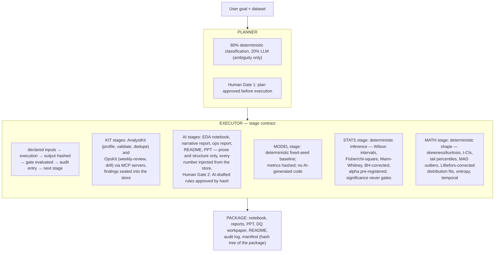

# Delivery Engine

[](https://github.com/MohdSaifHussain/delivery-engine/actions/workflows/ci.yml)


**Project patterns as governed, executable workflows.**
Agent proposes · deterministic tools dispose · human governs · every claim traceable.

An AI-governed data-analysis pipeline where a language model plans and writes
prose, but never computes a number that reaches a deliverable. Every figure in
every artifact is injected from a hash-verified Findings Store; every stage
passes a gate that can actually fail; every decision is recorded in an
append-only audit log. A reviewer who was never in the room can re-perform any
stage from the delivery package alone and get the same hashes. If they can, it
is evidence. If they cannot, it is just output.

## Who this is for, and why it matters

For data analysts and their reviewers. Most analysis tooling helps
you compute; almost none of it helps you **prove**. This engine
produces analysis a reviewer can re-perform and an auditor can
verify: every number in every deliverable traces to a hashed finding,
the input dataset is fingerprinted, statistics are pre-registered
before any p-value exists, and the report carries its own limitations
- leakage warnings, independence caveats, minimum detectable effects
- mapped to the published research on how analysts actually fail
(Panko's spreadsheet-error corpus through the 2026 governance
literature; see [STEP18_DECISIONS.md](STEP18_DECISIONS.md)). In production runs on
500,000-row datasets it caught a real target-leakage AUC-1.0 baseline
and a real 1.5M-false-exception tool bug before either reached a
stakeholder.

Bring your own dataset — CSV, Parquet, `.xlsx`, or SQLite, all read
through one reader: the **[analyst user guide (USER_GUIDE.md)](USER_GUIDE.md)** takes you
from an extract to a sealed package in one command
(`run_project.py`), and `generate_playbook.py` compiles a draft
playbook for your data - deterministically, as a draft a human must
approve, because a pipeline never approves its own rules of
engagement.

## Start here

- **[Quickstart: install and first run (QUICKSTART.md)](QUICKSTART.md)** — install, run an example in 60
  seconds, run it on your data, write your own playbook, choose your AI
  level. For engineers and non-engineers alike.
- **[Worked examples with committed output (examples/)](examples/)** — six complete end-to-end runs with real
  committed output, including a 6.36M-row fraud run, transaction
  monitoring (compliance), churn analysis (business analytics), and
  audit data quality (internal audit).

## The architecture



<details>
<summary>Text description of the architecture diagram</summary>

The pipeline flows top to bottom in four stages:

1. **User goal + dataset** enters the **Planner**, which does 80%
   deterministic classification and 20% LLM work for goal-wording
   ambiguity only, then stops at **Human Gate 1** — the plan is approved
   before anything executes.
2. The approved plan enters the **Executor**, which runs every stage
   under one contract: declared inputs, execution, output hashed, gate
   evaluated, audit entry written, next stage. The executor runs KIT
   stages (AnalystKit and OpsKit via MCP servers), AI stages (prose and
   structure only, every number injected from the store, with Human
   Gate 2 approving AI-drafted rules by hash), the MODEL stage
   (deterministic fixed-seed baseline), the STATS stage (pre-registered
   inference where significance never gates), and the MATH stage
   (deterministic descriptive shape).
3. All stages feed the **Package**: notebook, reports, PPT, DQ
   workpaper, README, audit log, and a manifest that is a hash tree of
   the entire package.

</details>

## The rules that make it evidence

- **Injected numbers.** AI stages never compute, estimate, or write a number.
  Every figure is pulled from the Findings Store and carries its hash. The
  `NumberInjector` enforces this by construction — an artifact containing a
  number not in the store fails verification.
- **Gates that fail.** A deterministic quality gate that cannot stop the
  pipeline is not a gate. Failed AnalystKit checks halt the run.
- **Content-bound human approval.** Human Gate 2 approves the exact SHA-256 of
  the AI-drafted artifact; approving a stale draft is refused.
- **Re-performability.** Same inputs → same hashes, proven by test at every
  stage. Timestamps live outside hashed content.
- **Pre-registered inference, never p-hacking.** The stats stage runs
  fixed, sourced procedures (Wilson intervals, Fisher exact, chi-square,
  Mann-Whitney, Benjamini-Hochberg FDR) with an alpha declared in the
  playbook and approved at Human Gate 1 - before any p-value exists.
  Effect sizes always accompany p-values. Feasibility failures gate;
  significance never does.
- **See it before it runs; sign it after.** Every run writes an
  `execution_preview.md` (what was about to execute, from the same
  documents the executor runs from) and a `handoff_manifest.json`
  (per-team checks generated from the hashed findings, signatures left
  null - the engine never signs for a human). Entry points can pass
  `preview_confirm=prompt_confirmation` to pause for a human before
  any stage runs; declining is an audited stop.
- **Guardrails against how analysts actually fail.** A leakage
  sentinel on the baseline (the answer key can't hide in the
  features), pseudoreplication disclosure on inference (p-values that
  assume independence say so when the data has repeated entities),
  minimum detectable effects beside every test, a fingerprint of the
  input dataset in the manifest (lineage: "the data changed" is
  provable), and a Limitations section in every report assembled only
  from recorded caveats - each control traced to published research
  in [STEP18_DECISIONS.md](STEP18_DECISIONS.md).
- **Playbooks, not code.** A new project type is a new TOML playbook, not new
  engine code. Eight playbooks ship: `churn_analysis`,
  `data_quality_review`, `transaction_monitoring_review`,
  `ops_review`, `segment_comparison`, `universal_audit`,
  `healthcare_claims_audit`, and `supplychain_audit`.

## Repository layout

| Path | What it is |
|---|---|
| `src/delivery_engine/` | The engine: planner, executor, store, artifacts, model, presentation |
| `playbooks/` | TOML archetypes — the project constitution as data |
| `analystkit-mcp/` | AnalystKit exposed as an MCP server, hashed findings envelopes |
| `opskit-mcp/` | OpsKit exposed as an MCP server, hashed findings envelopes |
| `tests/` | Planted-answer test suites, one per build step |
| `PROJECT_CHARTER.md` | The constitutional document — every design decision, dated |
| `PLAYBOOK_SPEC.md` | The playbook schema and its constitutional rules (V1–V15) |
| `STEP*_DECISIONS.md` | Per-step design records and loophole-hunt results |

## Running the gates

The three gates that guard every commit, mirrored exactly in CI:

```bash
# one-time setup
pip install "git+https://github.com/MohdSaifHussain/analystkit.git"
pip install -e ./analystkit-mcp -e ./opskit-mcp -e ".[dev,ml,stats]"
npm install pptxgenjs          # the presentation stage shells out to it

# the gates
ruff check src tests
mypy src/delivery_engine --strict
pytest -q
```

## Standards

Traced to primary sources: the Model Context Protocol specification and
official Python SDK (tool exposure), DAMA-DMBOK (the six data-quality
dimensions behind the gates), scikit-learn's controlling-randomness guidance
(the deterministic baseline), the statistical primary sources behind the
inference stage (Brown, Cai & DasGupta 2001 and the NIST/SEMATECH
e-Handbook for Wilson intervals; the ASA Statement on p-values 2016;
Benjamini & Hochberg 1995; scipy and statsmodels official documentation),
the PyPA src-layout, and DuckDB's official
documentation (the deterministic query layer). Python 3.12+, `mypy --strict`,
`ruff`, and a planted-answer testing discipline throughout.

---

Designed, specified, and governed by **Mohd Saif Hussain**.
Implementation is AI-directed; every architectural and security decision is
human-made and source-verified.


## Project Charter

The constitutional document governing all sessions — architecture principles, build timeline, human gates, and the v1.0 release record.

- 📋 [Interactive Charter](docs/PROJECT_CHARTER.html) — scroll-progress, collapsible build timeline, WCAG AA
- 📄 [Markdown source](PROJECT_CHARTER.md) — for the "upload two files to resume" workflow

---

## Run with Docker

```bash
# Build the image (first build: ~2-5 min)
docker build -t delivery-engine .

# Run the full test suite inside the container
docker run --rm delivery-engine

# Run a specific example inside the container
docker run --rm delivery-engine python examples/audit_data_quality/run_example.py
```

The container mirrors CI exactly: Python 3.12 + Node 24 + all dependencies.
367 tests pass in a clean environment with no local setup required.
