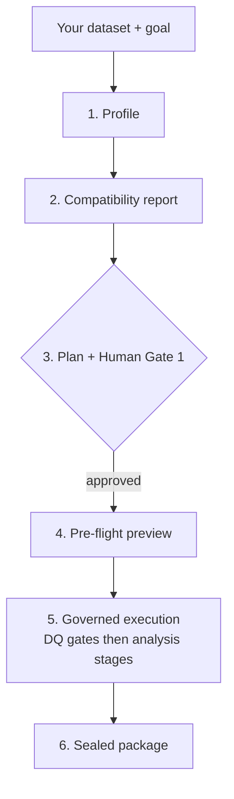

# USER GUIDE — Running Your Project Through the Delivery Engine

This guide is for the analyst who just arrived with a CSV and a
deadline. The [project overview (README.md)](README.md) explains what the engine is; the
[playbook specification (PLAYBOOK_SPEC.md)](PLAYBOOK_SPEC.md) defines what is legal; this document
shows you how to get from *your* dataset to a sealed, reviewable
package — in about ten minutes the first time, about one minute after
that.

## Contents

- [Why playbooks (the part nobody wrote down until now)](#why-playbooks-the-part-nobody-wrote-down-until-now)
- [The fastest path: one command](#the-fastest-path-one-command)
- [Supported formats](#supported-formats)
- [Your first playbook in ten minutes: the generator](#your-first-playbook-in-ten-minutes-the-generator)
- [Editing a draft into your team's standard](#editing-a-draft-into-your-teams-standard)
- [Model-stage evaluation keys (step 24)](#model-stage-evaluation-keys-step-24)
- [Declaring a package final](#declaring-a-package-final)
- [Reading the package like a reviewer](#reading-the-package-like-a-reviewer)
- [When a run fails before it starts](#when-a-run-fails-before-it-starts)
- [One warning worth repeating](#one-warning-worth-repeating)

## Why playbooks (the part nobody wrote down until now)

A playbook is **your team's analysis standard, frozen as a governed,
executable document**. When you write one, you are not configuring a
tool — you are codifying "this is how we audit claims / monitor
transactions / compare segments, every time, with the same gates, in
an order that cannot be skipped." The TOML file *is* the methodology:
reviewable in a pull request, versioned in git, identical for every
analyst who runs it. The engine's job is to make that document
enforceable — data-quality gates before analysis, human approval
before execution, hashed findings behind every number, a manifest
that proves nothing was altered.

Six curated playbooks ship with the engine (see `playbooks/`). They
are archetypes: `universal_audit` runs on almost anything,
`segment_comparison` adds statistical inference, `churn_analysis`
adds a baseline model. Start by running one of those; write your own
when your team's standard differs from the archetype.

## The fastest path: one command

```bash
python run_project.py \
    --source data/claims_q3.csv \
    --goal "Q3 claims quality audit for the compliance review" \
    --playbook universal_audit \
    --rules my_rules.json \
    --approver "Your Name"
```



What happens, in order:

1. **Profile** — AnalystKit profiles every column (types, nulls,
   distincts, DAMA scores).
2. **Compatibility report** — which playbooks fit this dataset and
   why (written to your output directory; read it when unsure which
   playbook to pick).
3. **Plan + Human Gate 1** — the engine proposes the column
   classification; your `--approver` name is recorded against it.
4. **Pre-flight preview** — the terminal shows exactly what will run:
   stages, gates, columns, the pre-registered alpha. Press ENTER to
   proceed or `n` to stop (an audited stop — nothing executes).
   `--yes` skips the pause for automation.
5. **Governed execution** — DQ gates first; analysis stages only
   after they pass; every finding hashed.
6. **The sealed package** — `narrative_report.md` (every figure
   injected from hashed findings, with a Limitations section),
   `handoff_manifest.json` (per-team checks, signature lines),
   `manifest.json` (the hash tree — verify it, and you have verified
   everything), `audit_log.jsonl` (why every gate passed or failed).

Rules files are plain JSON — your data expectations, stated before
the run:

```json
[
  {"column": "claim_id", "rule": "unique"},
  {"column": "claim_id", "rule": "not_null"},
  {"column": "status", "rule": "allowed",
   "values": ["approved", "denied", "pending"]}
]
```

If a playbook validates and you pass no rules, the runner tells you
immediately — before any work runs — rather than failing later.

## Supported formats

Bring the extract you actually have. Every format enters through the
same reader — the one the data-quality gate itself uses — so what the
gate profiled is exactly what the analysis stages see:

| Format | Notes |
|---|---|
| `.csv` | RFC 4180 quoting; unparseable rows recorded, not silently dropped |
| `.parquet` | The warehouse-extract standard. Nested/semi-structured columns (`LIST`, `STRUCT`, `MAP`, and the Variant type that went official in February 2026) are **refused by name** — this engine analyzes tables and will not silently flatten your evidence |
| `.xlsx` | Read via DuckDB's official `excel` extension. Two documented behaviours are disclosed rules: the **first sheet** is read, and numeric cells arrive as `DOUBLE` (so an integer `1` reads as `1.0` in class labels — the statistics are identical, only the label spelling differs). Legacy `.xls` is refused: save as `.xlsx` |
| `.db` / `.sqlite` | Attached read-only; the file must contain **exactly one table**, otherwise the refusal names the tables it found. A column with no single type (SQLite lets one column mix integers and text) is refused rather than analyzed as raw bytes |

Two things worth knowing:

- **Timezones.** A Parquet timestamp *with* a timezone is an instant.
  It is read as UTC, so an event at midnight IST falls on the previous
  UTC day. The engine does not silently re-zone your data — it records
  the note inside the hashed findings so you see it before a reviewer
  does.
- **The fingerprint covers the file.** For a SQLite source that means
  the whole database file, not just the table you analyzed.

## Your first playbook in ten minutes: the generator

When no curated playbook matches your standard, generate a draft:

```bash
python generate_playbook.py \
    --source data/claims_q3.csv \
    --goal "monthly claims audit" \
    --name claims_audit \
    --include math,stats
```

(Omit any flag at a terminal and you will be asked interactively.)

The generator profiles your data and compiles a playbook
**deterministically** — no AI in the path; the same dataset and the
same answers produce the same file, byte for byte. It only offers
stages your data can support (asking for statistical inference
without a binary target column is a refusal, not a broken file), and
it drafts validation rules from the evidence: uniqueness for your id
column, allowed-value sets for low-cardinality columns, values in
their native types. The output lands in `playbooks/generated/`:

- `claims_audit.toml` — the DRAFT playbook, headed by a review notice
- `claims_audit.rules.json` — the evidence-drafted rules

**Then the part that matters: read both files.** The draft is a
proposal, not a decision — a pipeline must never approve its own
rules of engagement. When you have reviewed the stages and gates, run
it, stating so by name:

```bash
python run_project.py \
    --source data/claims_q3.csv \
    --goal "monthly claims audit" \
    --playbook claims_audit \
    --rules playbooks/generated/claims_audit.rules.json \
    --approver "Your Name" \
    --playbook-approved-by "Your Name"
```

Without `--playbook-approved-by`, the runner refuses to execute a
generated draft — that is the point, not an inconvenience. Generated
playbooks also never enter the automatic playbook-matching: they run
only when named explicitly.

## Editing a draft into your team's standard

The generated file is ordinary playbook TOML. Typical first edits:
raise `min_rows`, tighten an allowed-values rule, change the alpha in
`[stats]` (it is pre-registered — approved with the plan, fixed before
any p-value exists), or bump the version and move the file from
`generated/` into `playbooks/` once it has earned curated status.
Every edit is checked against the constitution (rules V1–V15 in
the [playbook specification (PLAYBOOK_SPEC.md)](PLAYBOOK_SPEC.md)) the moment the file loads — an invalid playbook
refuses to load with the rule number and the reason.

## Model-stage evaluation keys (step 24)

Three optional `kind = "model"` stage keys make the baseline's evidence
more honest about what it measured. All three are opt-in and default to
the exact pre-step-24 behaviour — a playbook that declares none of them
trains and reports byte-identical findings to before these keys existed
(verified by re-running every shipped example with a committed golden and
comparing findings digests; see `PROJECT_CHARTER.md`'s v1.5 amendment).

**`metric_ci`** (bool, default `false`). When `true`, adds Wilson score
95% confidence intervals for recall and precision — Brown, Cai &
DasGupta (2001), "Interval Estimation for a Binomial Proportion",
*Statistical Science* 16(2); NIST/SEMATECH e-Handbook of Statistical
Methods §7.2.4.1; computed by
`statsmodels.stats.proportion.proportion_confint(method="wilson")` via
`delivery_engine.stats.wilson_interval` — the same function the stats
stage uses, not a second implementation. Adds to findings:
`n_positives_in_test`, `recall_ci95`, `precision_ci95`, `metric_ci_alpha`,
`metric_ci_alpha_source`, `metric_ci_skipped`, `metric_ci_caveat`. Alpha
is the playbook's pre-registered `[stats]` alpha when a stats stage
exists (`metric_ci_alpha_source = "pre_registered"`), else a disclosed
engine default of 0.05 (`"engine_default_disclosed"`). Zero positive
cases, or zero predicted positives, is recorded in `metric_ci_skipped`
with a reason — never a crash, never a fabricated interval.

**`split`** (`"random"` | `"time_ordered"` | `"walk_forward"`, default
`"random"`). Sourced to scikit-learn's own `TimeSeriesSplit`
documentation: ordinary cross-validation on time-ordered data trains on
the future and evaluates on the past, which is not what a real
deployment will ever do. The ordering column is always the plan's
classified `timestamp_column` — never guessed, never row order;
declaring `time_ordered` or `walk_forward` with no classified timestamp
column is a clean feasibility refusal naming the remedy, not a silent
fallback. `"time_ordered"` holds out the last portion of a stably
time-sorted dataset as the test set (no shuffle, no stratify).
`"walk_forward"` runs `TimeSeriesSplit` and evaluates a fresh pipeline
per fold. Either mode adds `split_mode` and `ordering_column` to
findings; `walk_forward` additionally adds `n_splits`, `folds` (each
fold's train size, test size, positive count, and metrics — or a
disclosed skip with a reason if a fold's train or test portion holds a
single class), and `fold_metrics_summary` (mean, min, and max **per
metric, in the same dict** — the range sits structurally beside the
mean, so a consumer cannot read the average alone and miss a fold that
caught nothing).

**`n_splits`** (int, default `5`, minimum `2`). Legal only when
`split = "walk_forward"` — declaring it with any other split is a
playbook validation error naming the reason.

One stage declaring all three:

```toml
[[stages]]
id = "baseline"
kind = "model"
gate = "must_pass"
metric_ci = true
split = "walk_forward"
n_splits = 5
needs = ["dq_gate"]
```

<details>
<summary>Findings shape for the stage above (illustrative excerpt)</summary>

```json
{
  "model": "LogisticRegression(max_iter=1000)",
  "split": "time_series_walk_forward",
  "split_mode": "walk_forward",
  "ordering_column": "test_time",
  "n_splits": 5,
  "target": "pass_fail",
  "n_positives_in_test": 5,
  "recall_ci95": {"ci_low": 0.230724, "ci_high": 0.882379},
  "precision_ci95": {"ci_low": 0.300642, "ci_high": 0.954413},
  "metric_ci_alpha": 0.05,
  "metric_ci_alpha_source": "engine_default_disclosed",
  "metric_ci_skipped": [],
  "metric_ci_caveat": "recall and precision above carry Wilson score 95% confidence intervals (Brown, Cai & DasGupta 2001) at alpha=0.05 (engine_default_disclosed); recall was estimated from 5 positive case(s) in the test set - a point estimate from a small count can look precise while remaining highly uncertain.",
  "folds": [
    {"fold": 1, "train_size": 40, "test_size": 20, "n_positives": 0,
     "skipped": true,
     "reason": "this fold's test portion contains a single class (0 positive case(s)) - recall, precision and roc_auc are undefined; no metrics are fabricated"},
    {"fold": 2, "train_size": 60, "test_size": 20, "n_positives": 3,
     "metrics": {"accuracy": 0.85, "precision": 0.667, "recall": 0.333, "f1": 0.444, "roc_auc": 0.71}},
    {"fold": 3, "train_size": 80, "test_size": 20, "n_positives": 5,
     "metrics": {"accuracy": 0.9, "precision": 0.75, "recall": 0.6, "f1": 0.667, "roc_auc": 0.82}}
  ],
  "fold_metrics_summary": {
    "accuracy": {"mean": 0.875, "min": 0.85, "max": 0.9},
    "precision": {"mean": 0.7085, "min": 0.667, "max": 0.75},
    "recall": {"mean": 0.4665, "min": 0.333, "max": 0.6},
    "f1": {"mean": 0.5555, "min": 0.444, "max": 0.667},
    "roc_auc": {"mean": 0.765, "min": 0.71, "max": 0.82}
  }
}
```

`metric_ci` here reflects the last successful fold (fold 3: 5 positive
cases, 3 true positives — recall 3/5 = 0.6, precision 3/4 = 0.75). This
is a shortened, illustrative excerpt — the real findings dict also
carries `leakage_warnings`, `g2_pseudoreplication`, and
`g3_minimum_detectable_effect`, unaffected by these keys.

</details>

## Declaring a package final

After the package is sealed you can record your accountability as
the human who reviewed and approved it:

```bash
python declare_final.py \
    --package output/final \
    --declarer "Your Name, Role"
```

The engine presents a structured review summary — playbook, goal,
key findings (DAMA scores, model metrics, G2/G3 disclosures),
and the limitations the engine has disclosed. Type `CONFIRMED` to
proceed.

What gets written:

- `declaration.json` — your name, timestamps (UTC and IST), the
  four items you confirmed, the manifest SHA-256 you are signing,
  and a `content_sha256` that is independently verifiable.
- `manifest.json` — regenerated to include `declaration.json` in
  its hash tree. Alter either file and the other's check fails.

**Framework basis:** EU AI Act Article 14 (human oversight, named
and timestamped) · NIST AI RMF MANAGE-4.1 (tamper-evident human
confirmation) · ISO/IEC 42001:2023 §6.1.2 (human review of AI
outputs) · Maker-Checker / Four-Eyes principle.

This is a non-gating act — packages without a declaration are
valid. The declaration is evidence that a named human reviewed the
package with understanding, not just that the engine ran.

## Reading the package like a reviewer

- Start with `narrative_report.md` — the findings, then **Limitations
  & assumptions** (freshness, independence, detectable-effect sizes,
  possible leakage — read this section first if you read only one).
- `handoff_manifest.json` — what data engineering, QA, compliance,
  and the manager each need to check, with the hash of the evidence
  behind every check. Signatures start `null`; the engine never signs
  for a human.
- `manifest.json` — recompute any file's SHA-256 and compare; the
  `source_fingerprint` proves which exact input produced this
  package.
- `audit_log.jsonl` — the run's full story, including anything that
  was skipped, flagged, or stopped, with reasons.

## When a run fails before it starts

The audit log is written by the executor, so a failure *before* the
executor starts leaves you nothing to read — a source that will not
load, a playbook that will not validate, a missing dependency. For
those, the engine writes a diagnostic instead:

```bash
python diagnose.py
```

`delivery-engine-diagnostic.json` records the PEP 508 environment
markers, the encodings that affect the engine's own I/O, the installed
versions of the packages that change engine behaviour (analystkit,
duckdb, pandas, scikit-learn, scipy), whether Node is on PATH, and —
when it is a crash report — where the fault occurred, as
`basename.py:LINE in function`.

The encoding block sits apart from the PEP 508 block deliberately: those
names are a published standard, and a maintainer must be able to read
them literally. `stdout_encoding` is the one that repays the space. The
engine prints em-dashes and box-drawing characters — `declare_final.py`
draws a review summary out of them — so redirecting output to a file on
a system whose locale is cp1252 raises `UnicodeEncodeError` from the
engine's own `print` calls. That traceback names a print statement, not
an encoding, and is close to unreadable without knowing what stdout was
set to.

`run_project.py` writes this automatically on an unexpected failure and
tells you where. Handled refusals do not trigger it: a missing rules
file or an unapproved generated playbook is the engine working as
designed, not a defect.

What the record does **not** contain: usernames, hostnames, absolute
paths, environment variables, dataset content, or column names. The
source file appears by extension only (`.parquet`), because the
extension names the reader path that failed while the path would name
your directory structure. Nothing is transmitted; attaching it to an
issue is your decision.

## One warning worth repeating

> [!WARNING]
> If validation reports a mountain of exceptions, that is **evidence** —
of dirty data, or of wrong rules. Diagnose before overriding: a real
production run once "fixed" 1.5 million false exceptions by raising
the gate to 400%, when the true cause was a one-character rule bug
(fixed since — AnalystKit v2.0.2 compares each column type in its own
domain). The `--max-exception-rate` flag exists because judgment is
human; the loud warning it prints exists because silence is how
overrides become habits.
